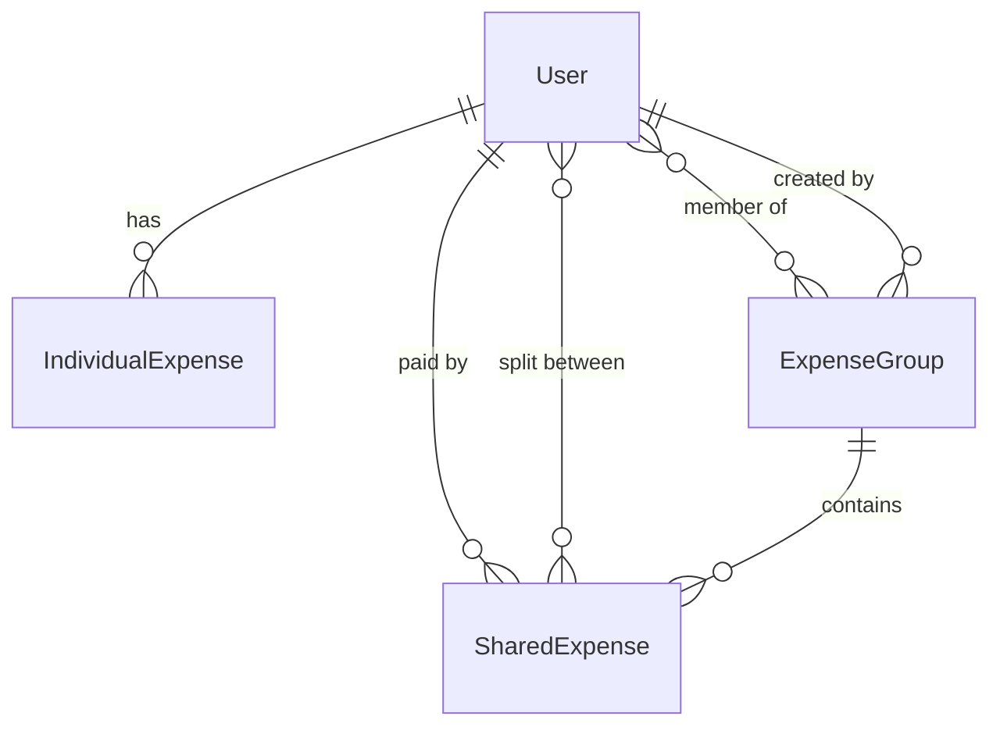

# Expense Backend — API Reference & Architecture

## Entity Relationship

## N+1 Prevention Strategy

| Operation | Queries | How |
|-----------|---------|-----|
| List groups | **2** | `JOIN FETCH` groups+members, then 1 aggregate for stats |
| Group detail | **2** | `JOIN FETCH` group+members, then `JOIN FETCH` expenses+paidBy+splitBetween |
| List shared expenses | **1** | `JOIN FETCH` expenses+paidBy+splitBetween |
| List individual expenses | **1** | No collections to fetch — flat entity |

## API Endpoints

### Auth (public — no token needed)
| Method | Endpoint | Body |
|--------|----------|------|
| POST | `/api/auth/register` | `{ name, email, password }` |
| POST | `/api/auth/login` | `{ email, password }` |

### Individual Expenses (Bearer token required)
| Method | Endpoint | Body |
|--------|----------|------|
| GET | `/api/expenses` | — |
| POST | `/api/expenses` | `{ title, amount, category, date }` |
| PUT | `/api/expenses/{id}` | `{ title, amount, category, date }` |
| DELETE | `/api/expenses/{id}` | — |

### Groups (Bearer token required)
| Method | Endpoint | Body |
|--------|----------|------|
| GET | `/api/groups` | — |
| GET | `/api/groups/{id}` | — |
| POST | `/api/groups` | `{ name, emoji, description, memberIds[] }` |
| POST | `/api/groups/{id}/members` | `{ email }` |
| DELETE | `/api/groups/{id}` | — |

### Shared Expenses (Bearer token required)
| Method | Endpoint | Body |
|--------|----------|------|
| GET | `/api/groups/{groupId}/expenses` | — |
| POST | `/api/groups/{groupId}/expenses` | `{ title, amount, category, date, paidById, splitBetweenIds[] }` |
| DELETE | `/api/groups/{groupId}/expenses/{id}` | — |

## Files Created

### Entities
- [IndividualExpense.java](file:///d:/Sahil/Tutorials/Internship%20project/backend/expenseBackend/src/main/java/com/expense/model/IndividualExpense.java)
- [ExpenseGroup.java](file:///d:/Sahil/Tutorials/Internship%20project/backend/expenseBackend/src/main/java/com/expense/model/ExpenseGroup.java)
- [SharedExpense.java](file:///d:/Sahil/Tutorials/Internship%20project/backend/expenseBackend/src/main/java/com/expense/model/SharedExpense.java)

### Repositories (with JOIN FETCH queries)
- [IndividualExpenseRepository.java](file:///d:/Sahil/Tutorials/Internship%20project/backend/expenseBackend/src/main/java/com/expense/repository/IndividualExpenseRepository.java)
- [ExpenseGroupRepository.java](file:///d:/Sahil/Tutorials/Internship%20project/backend/expenseBackend/src/main/java/com/expense/repository/ExpenseGroupRepository.java)
- [SharedExpenseRepository.java](file:///d:/Sahil/Tutorials/Internship%20project/backend/expenseBackend/src/main/java/com/expense/repository/SharedExpenseRepository.java)

### Services
- [IndividualExpenseService.java](file:///d:/Sahil/Tutorials/Internship%20project/backend/expenseBackend/src/main/java/com/expense/service/IndividualExpenseService.java)
- [GroupService.java](file:///d:/Sahil/Tutorials/Internship%20project/backend/expenseBackend/src/main/java/com/expense/service/GroupService.java)
- [SharedExpenseService.java](file:///d:/Sahil/Tutorials/Internship%20project/backend/expenseBackend/src/main/java/com/expense/service/SharedExpenseService.java)

### Controllers
- [IndividualExpenseController.java](file:///d:/Sahil/Tutorials/Internship%20project/backend/expenseBackend/src/main/java/com/expense/controller/IndividualExpenseController.java)
- [GroupController.java](file:///d:/Sahil/Tutorials/Internship%20project/backend/expenseBackend/src/main/java/com/expense/controller/GroupController.java)
- [SharedExpenseController.java](file:///d:/Sahil/Tutorials/Internship%20project/backend/expenseBackend/src/main/java/com/expense/controller/SharedExpenseController.java)

### DTOs
- `Dto/ExpenseDto/` — IndividualExpenseReq, IndividualExpenseResp, SharedExpenseReq, SharedExpenseResp
- `Dto/GroupDto/` — GroupReq, GroupResp, GroupDetailResp, MemberResp, AddMemberReq
